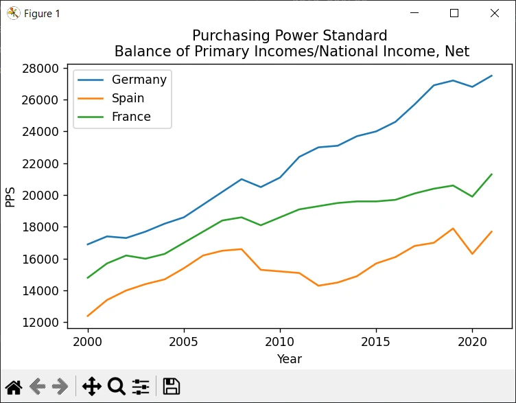
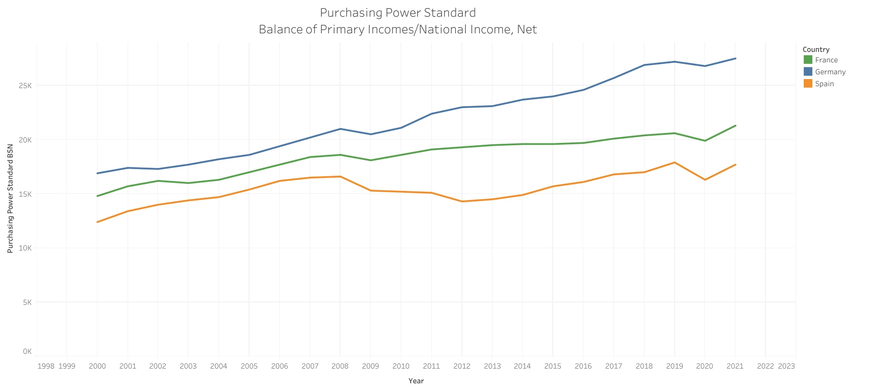

# Incomes of Households by Region in Europe

## Tableau Visualization

- [Income of Households by Region in Europe - Tableau](https://public.tableau.com/shared/ZGCD3X6BY?:display_count=n&:origin=viz_share_link)

## Data Source
- [Income of households by NUTS 2 region - eurostat](https://ec.europa.eu/eurostat/databrowser/view/nama_10r_2hhinc__custom_13225473/default/table?lang=en)

## Data Code Meaning
If you are curious what some of the codes used in the `generate_dataset.py` script mean,
check of the *Code Meaning* docs for more information.
- [Code Meaning](./docs/code_meaning.md)